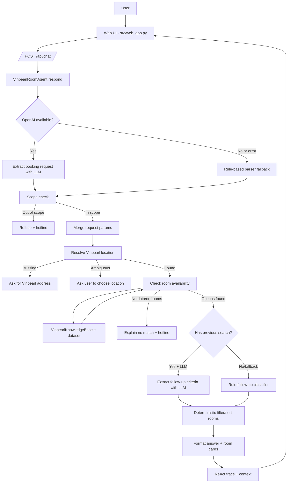

# Vinpearl Room Agent Architecture

Tài liệu này giải thích kiến trúc của agent tìm phòng trống Vinpearl trong repo. Mục tiêu là giúp bạn hiểu hệ thống đang chạy như thế nào, LLM được dùng ở đâu, tool/dataset được dùng ở đâu, và vì sao agent không trả lời ngoài phạm vi.

## 1. Mục Tiêu Agent

Agent này chỉ xử lý một miền nghiệp vụ hẹp:

- Tìm phòng trống tại cơ sở Vinpearl trong dataset demo.
- Bắt buộc người dùng cung cấp hoặc chọn cơ sở/địa chỉ Vinpearl.
- Kiểm tra ngày nhận phòng, ngày trả phòng, số khách.
- Trả danh sách phòng còn trống kèm giá, diện tích, sức chứa, giường, bữa ăn, chính sách hủy, tiện ích, ưu đãi.
- Trả lời follow-up dựa trên kết quả tìm kiếm gần nhất, ví dụ:
  - "phòng khác không?"
  - "tôi cần phòng trên 80m2"
  - "tôi cần giường king, buffet sáng, phòng lớn"
  - "chi tiết phòng 2"
  - "phòng nào tài chính vừa thì nên chọn?"
- Từ chối câu hỏi ngoài phạm vi và hướng người dùng liên hệ hotline nếu dữ liệu demo không đủ.

Điểm quan trọng: LLM không được dùng để bịa phòng hoặc bịa giá. LLM chỉ hỗ trợ hiểu ý định/trích xuất tiêu chí. Kết quả phòng luôn được lọc từ dataset demo bằng code.

## 2. Các File Chính

| File | Vai trò |
| --- | --- |
| `src/web_app.py` | Web UI và HTTP API `/api/chat`, `/api/locations`. Khởi tạo agent và provider OpenAI. |
| `src/agent/vinpearl_agent.py` | Domain agent chính cho Vinpearl. Điều phối LLM, rule parser, dataset tool, context, trace, response. |
| `src/tools/vinpearl_tools.py` | Knowledge base đọc dataset, resolve cơ sở Vinpearl, kiểm tra phòng trống, tính giá/ưu đãi. |
| `data/vinpearl_nationwide_agent_demo_dataset.json` | Dataset demo về cơ sở Vinpearl, room types, availability, policies, promotions. |
| `src/core/openai_provider.py` | Wrapper gọi OpenAI Chat Completions API. |
| `src/telemetry/logger.py` | Structured JSON logger ghi log vào `logs/YYYY-MM-DD.log`. |
| `tests/test_vinpearl_agent.py` | Test các hành vi chính của agent. |
| `tests/test_vinpearl_area_followup.py` | Test follow-up lọc theo diện tích. |

Ngoài ra repo vẫn có `src/agent/agent.py` là generic ReAct agent skeleton của lab. Vinpearl UI hiện dùng `VinpearlRoomAgent`, không dùng trực tiếp generic `ReActAgent`.

## 3. Kiến Trúc Tổng Quan



## 4. Luồng Xử Lý Một Câu Hỏi

Khi người dùng gửi tin nhắn từ UI:

1. `src/web_app.py` nhận request tại `/api/chat`.
2. Server gọi `VinpearlRoomAgent.respond(message, context)`.
3. Agent ghi log `VINPEARL_AGENT_START`.
4. Nếu có OpenAI key, agent gọi `_extract_request_with_llm()` để trích xuất:
   - `intent`
   - `location_query`
   - `checkin`
   - `checkout`
   - `guests`
5. Nếu OpenAI lỗi, agent fallback sang parser nội bộ. Nếu lỗi 401/invalid key, agent tắt LLM cho session đó bằng `llm_disabled_reason`.
6. Agent kiểm tra câu hỏi có thuộc phạm vi tìm phòng Vinpearl không.
7. Agent resolve cơ sở Vinpearl:
   - Không có cơ sở: hỏi lại người dùng.
   - Có nhiều cơ sở khớp: yêu cầu chọn rõ.
   - Có một cơ sở rõ: tiếp tục.
8. Agent kiểm tra ngày và số khách.
9. Agent gọi `VinpearlKnowledgeBase.check_room_availability()`.
10. Nếu có kết quả trước đó, agent xử lý follow-up:
    - Dùng rule parser.
    - Nếu có OpenAI, gọi thêm `_extract_follow_up_with_llm()` để hiểu tiêu chí phức tạp.
11. Agent lọc/sort danh sách phòng bằng code.
12. Agent format câu trả lời, room cards, context mới và trace.
13. Agent ghi log `VINPEARL_QA`.
14. UI hiển thị answer, room cards và `ReAct trace`.

## 5. OpenAI Được Dùng Ở Đâu?

OpenAI được gọi qua `src/core/openai_provider.py`.

Trong Vinpearl agent có 2 điểm gọi LLM chính:

### 5.1. Extract Booking Request

Hàm:

```python
_extract_request_with_llm(message, context)
```

Nhiệm vụ:

- Xác định câu hỏi có phải tìm phòng không.
- Trích xuất cơ sở Vinpearl/ngày/số khách.
- Chuẩn hóa ngày thiếu năm về năm 2026 theo dataset demo.

Trace hiển thị trong UI:

```text
Action: openai_extract_booking_request(message=...)
Observation: {"provider": "openai", "model": "gpt-4o", "usage": ...}
```

### 5.2. Extract Follow-up Criteria

Hàm:

```python
_extract_follow_up_with_llm(message, context, options)
```

Nhiệm vụ:

- Hiểu follow-up sau khi đã có kết quả tìm phòng.
- Trích xuất tiêu chí như:
  - `bed_keywords`: ví dụ `king`
  - `amenity_keywords`: ví dụ `buffet`
  - `min_area_sqm`, `max_area_sqm`
  - `sort`: `cheapest`, `largest`, `premium`, `moderate`
  - `recommendation`

Trace hiển thị trong UI:

```text
Action: openai_extract_follow_up_criteria(message=...)
Observation: {"type": "refine", "criteria": ...}
```

Ví dụ:

```text
User: tôi cần phòng có giường King, buffet sáng, diện tích phòng lớn
LLM criteria: {"bed_keywords":["king"],"amenity_keywords":["buffet"],"sort":"largest"}
Code filter result: chỉ trả phòng có giường king + buffet, sort theo diện tích.
```

## 6. Vì Sao Không Để LLM Trả Danh Sách Phòng Trực Tiếp?

Vì dữ liệu phòng, giá, tồn kho, diện tích là dữ liệu có cấu trúc. Nếu để LLM tự trả lời, nó có thể:

- Bịa phòng không có trong dataset.
- Bịa giá.
- Bịa số phòng còn trống.
- Trả lại danh sách cũ dù người dùng thêm tiêu chí mới.

Do đó kiến trúc hiện tại tách trách nhiệm rõ:

| Thành phần | Trách nhiệm |
| --- | --- |
| LLM | Hiểu ý định, trích xuất tham số và tiêu chí. |
| Rule parser | Fallback khi LLM lỗi, xử lý các pattern chắc chắn. |
| Knowledge base/tool | Tìm cơ sở, kiểm tra availability, tính giá, lấy policies/promotions. |
| Code filter | Lọc/sort phòng theo tiêu chí, đảm bảo không bịa dữ liệu. |
| Formatter | Biến dữ liệu đã lọc thành câu trả lời tiếng Việt. |

## 7. Context Và Bộ Nhớ Hội Thoại

Agent trả về `context` sau mỗi lượt chat. UI giữ context này và gửi lại ở lượt sau.

Các trường quan trọng:

| Field | Ý nghĩa |
| --- | --- |
| `hotel_id` | Cơ sở Vinpearl đã xác định. |
| `location` | Tên cơ sở + địa chỉ. |
| `checkin` | Ngày nhận phòng. |
| `checkout` | Ngày trả phòng. |
| `guests` | Số khách. |
| `last_search` | Thông tin tìm phòng gần nhất. |
| `last_room_options` | Danh sách phòng khả dụng từ lần search gần nhất. |
| `last_displayed_room_ids` | Các phòng vừa hiển thị. |
| `shown_room_type_ids` | Các phòng đã từng hiển thị để tránh lặp khi hỏi "phòng khác". |
| `selected_room_type_id` | Phòng đang được chọn khi người dùng hỏi chi tiết. |

Nhờ context, agent hiểu được câu follow-up ngắn như:

```text
phòng khác không?
chi tiết phòng 2
tôi cần phòng trên 80m2
đổi sang ngày 18
```

## 8. Tool Và Dataset

Knowledge base chính nằm trong `src/tools/vinpearl_tools.py`.

### 8.1. Resolve Location

Agent dùng:

```python
kb.find_locations(...)
kb.resolve_hotel(...)
```

Để xử lý các trường hợp:

- Người dùng nhập đúng tên cơ sở.
- Người dùng nhập địa chỉ.
- Người dùng chỉ nhập vùng như "Phú Quốc", "Nha Trang".
- Người dùng nhập tên không dấu.

Nếu chỉ nhập vùng và có nhiều cơ sở, agent trả `ambiguous_location` và yêu cầu chọn.

### 8.2. Check Availability

Agent dùng:

```python
kb.check_room_availability(hotel_id, checkin, checkout, guests)
```

Hàm này:

- Kiểm tra ngày hợp lệ.
- Kiểm tra ngày nằm trong range dataset demo.
- Loại phòng hết phòng hoặc stop-sell.
- Loại phòng không đủ sức chứa.
- Tính tổng giá theo các đêm.
- Áp dụng promotion.
- Gắn meal plan, cancellation policy, amenities.

## 9. Các Loại Response Chính

| Status | Khi nào xảy ra |
| --- | --- |
| `ok` | Có kết quả hợp lệ. |
| `out_of_scope` | Câu hỏi ngoài miền tìm phòng Vinpearl. |
| `missing_location` | Chưa có cơ sở/địa chỉ Vinpearl. |
| `ambiguous_location` | Có nhiều cơ sở khớp, cần người dùng chọn. |
| `missing_dates` | Thiếu ngày nhận/trả phòng. |
| `invalid_dates` | Ngày trả phòng không sau ngày nhận phòng. |
| `out_of_range` | Ngày nằm ngoài dataset demo. |
| `no_rooms` | Không có phòng trống theo điều kiện chính. |
| `no_more_rooms` | Không có phòng phù hợp theo follow-up/filter. |

Nếu ngoài phạm vi hoặc không có dữ liệu phù hợp, agent thêm hotline:

```text
Nếu cần tư vấn ngoài dữ liệu demo, vui lòng liên hệ hotline 1900 56 56 56.
```

## 10. ReAct Trace Trong App

Mỗi response có `trace` và `trace_text`.

UI hiển thị dưới dạng:

```text
Thought: ...
Action: ...
Observation: ...
Final Answer: ...
```

Trace này giúp demo đúng tinh thần lab:

- Agent nghĩ gì.
- Agent gọi action/tool nào.
- Observation trả về gì.
- Vì sao ra câu trả lời cuối.

Ví dụ action quan trọng:

```text
openai_extract_booking_request(message=...)
get_vinpearl_locations(keyword='...')
check_room_availability(...)
openai_extract_follow_up_criteria(message=...)
classify_follow_up(message='...')
```

## 11. Logging Và Debug

Logger nằm ở `src/telemetry/logger.py`, ghi JSON lines vào:

```text
logs/YYYY-MM-DD.log
```

Các event quan trọng:

| Event | Ý nghĩa |
| --- | --- |
| `VINPEARL_AGENT_START` | Bắt đầu xử lý một tin nhắn. |
| `OPENAI_EXTRACT_REQUEST` | OpenAI trích xuất request thành công. |
| `OPENAI_EXTRACT_REQUEST_FAILED` | OpenAI request extraction lỗi. |
| `OPENAI_EXTRACT_FOLLOW_UP` | OpenAI trích xuất follow-up thành công. |
| `OPENAI_EXTRACT_FOLLOW_UP_FAILED` | OpenAI follow-up extraction lỗi. |
| `VINPEARL_AGENT_END` | Agent xử lý thành công và có kết quả. |
| `VINPEARL_QA` | Log câu hỏi, câu trả lời, status, summary, room_cards. |

Khi cần xem câu hỏi/câu trả lời đã lưu:

```powershell
Get-Content logs\2026-06-01.log | Select-String "VINPEARL_QA"
```

Khi cần xem OpenAI có được gọi không:

```powershell
Get-Content logs\2026-06-01.log | Select-String "OPENAI_EXTRACT"
```

Nếu thấy:

```text
provider: openai
model: gpt-4o
usage: {...}
cost: {...}
```

thì app đã gọi OpenAI API thật.

Từ bản cập nhật telemetry, mỗi lần gọi OpenAI còn có thêm:

- `usage.prompt_tokens`, `usage.completion_tokens`, `usage.total_tokens`
- `cost.input_cost_usd`, `cost.output_cost_usd`, `cost.total_cost_usd`
- `llm_metrics` trong response `VINPEARL_QA`, tổng hợp token và cost của cả lượt chat

Chi phí là ước tính theo USD/1M token trong `src/core/openai_provider.py`. Nếu cần dùng bảng giá khác, cấu hình:

```env
OPENAI_INPUT_COST_PER_1M_TOKENS=2.50
OPENAI_OUTPUT_COST_PER_1M_TOKENS=10.00
```

## 12. UI/API

`src/web_app.py` dùng `ThreadingHTTPServer`, không cần frontend framework.

Endpoint:

| Endpoint | Method | Mục đích |
| --- | --- | --- |
| `/` | GET | Trả HTML UI. |
| `/api/locations` | GET | Trả danh sách cơ sở Vinpearl cho sidebar. |
| `/api/chat` | POST | Gửi message + context vào agent. |

Payload `/api/chat`:

```json
{
  "message": "Tim phong Vinpearl Golf Nha Trang tu 03/06 den 05/06 cho 2 nguoi",
  "context": {}
}
```

Response chính:

```json
{
  "answer": "...",
  "status": "ok",
  "trace": [],
  "trace_text": "...",
  "context": {},
  "room_cards": [],
  "location_options": [],
  "summary": {}
}
```

## 13. Chạy App

```powershell
python src\web_app.py --host 127.0.0.1 --port 8765
```

Mở:

```text
http://127.0.0.1:8765
```

`.env` cần có:

```env
DEFAULT_PROVIDER=openai
OPENAI_API_KEY=...
DEFAULT_MODEL=gpt-4o
```

Trong `src/web_app.py`, app dùng:

```python
load_dotenv(PROJECT_ROOT / ".env", override=True)
```

Nghĩa là `.env` của project sẽ được ưu tiên hơn biến môi trường hệ thống.

## 14. Test Coverage Hiện Có

Chạy:

```powershell
python -m pytest -q
```

Các nhóm test chính:

- Từ chối câu hỏi ngoài phạm vi.
- Bắt buộc có địa chỉ/cơ sở Vinpearl.
- Xử lý location mơ hồ.
- Trả room cards khi có phòng.
- Gọi OpenAI khi cấu hình LLM.
- Follow-up phòng khác.
- Chi tiết phòng theo số thứ tự.
- Hỏi bữa ăn/chính sách/tiện ích.
- Đổi ngày checkout bằng follow-up.
- Gợi ý phòng tài chính vừa.
- Lọc theo diện tích trên/dưới.
- Lọc nhiều tiêu chí: giường king + buffet + phòng lớn.
- Không có dữ liệu thì trả hotline.

## 15. Cách Giải Thích Khi Demo

Có thể nói ngắn gọn như sau:

> Agent này không phải chatbot trả lời tự do. Nó là domain-specific ReAct agent. LLM được dùng để hiểu ý định và trích xuất tham số, còn dữ liệu phòng/giá/tồn kho được lấy từ dataset qua tool nội bộ. Sau mỗi lần tìm phòng, agent lưu context để hiểu follow-up. Nếu người dùng hỏi tiêu chí mới như giường king, buffet sáng, phòng lớn, LLM trích xuất criteria, sau đó code lọc lại room options từ dataset. Vì vậy agent vừa linh hoạt với ngôn ngữ tự nhiên, vừa không bịa dữ liệu ngoài dataset.

## 16. Điểm Cần Nhớ

- LLM là parser/intent extractor, không phải nguồn dữ liệu.
- Dataset/tool là nguồn sự thật.
- Context giúp follow-up hoạt động.
- Trace giúp debug và chứng minh ReAct loop.
- Log giúp phân tích lỗi và làm report scoring.
- Guardrail giữ agent trong phạm vi tìm phòng Vinpearl.
