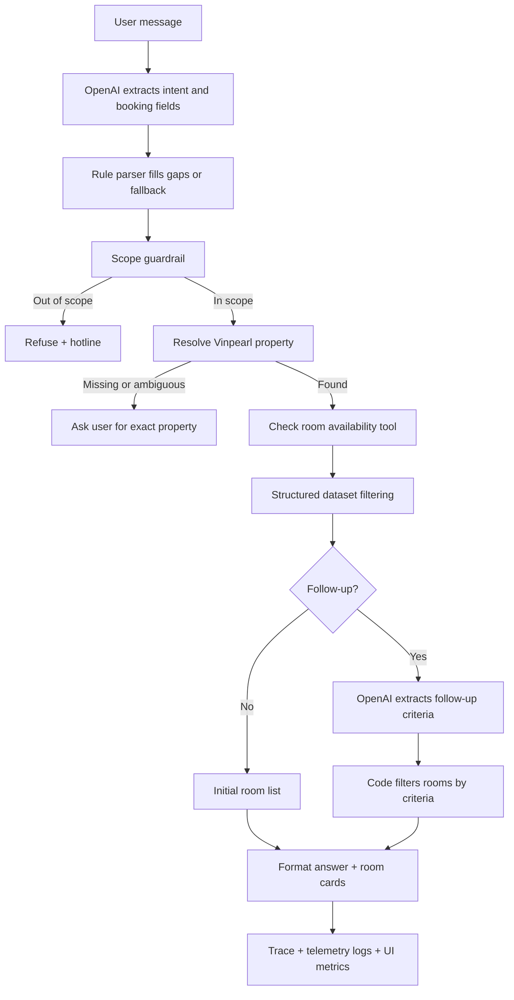

# Group Report: Lab 3 - Vinpearl Room Agent

- **Team Name**: Vinpearl Room Agent Team
- **Team Members**:
  - Lê Văn Khoa - 2A202600603
  - Nguyễn Phúc Hiếu - 2A202600747
  - Lê Quang Hưng - 2A202600891
- **Deployment Date**: 2026-06-01
- **Repository Branches**: `main`, `Khoa`
- **Final Test Command**: `python -m pytest -q`
- **Final Test Result**: `20 passed`

---

## 1. Executive Summary

The team built a domain-specific ReAct-style agent for Vinpearl room availability. The agent only answers room-search questions, requires a Vinpearl property or address before checking inventory, supports multi-turn follow-up questions, and refuses unrelated requests with a hotline handoff.

The main design decision is to separate language understanding from factual booking data:

```text
LLM = intent and criteria extraction
Tools / dataset = source of truth
Code filters = final room decision
Formatter = final user answer
```

This prevents the LLM from inventing room names, prices, policies, availability, or promotions.

Key outcome:

- The chatbot baseline can produce fluent but unreliable answers for room availability.
- Agent v1 introduced ReAct trace, location lookup, and availability tools.
- Agent v2 fixed follow-up failures, added LLM-based criteria extraction, deterministic filtering, guardrails, token tracking, and cost estimation.

---

## 2. Rubric Coverage Map

### 2.1 Base Group Score: 45 Points

| Scoring Category | Points | Evidence in This Project |
| :--- | ---: | :--- |
| Chatbot Baseline | 2 | Baseline behavior is documented in ablation tables: direct chatbot-style answering is compared against the tool-backed agent and shown to be unreliable for structured booking data. |
| Agent v1 Working | 7 | `src/agent/vinpearl_agent.py` implements a ReAct-style flow with `Thought -> Action -> Observation -> Final Answer`; it uses multiple tools: location resolution, room availability, follow-up classification/filtering. |
| Agent v2 Improved | 7 | v2 addresses failures from v1: area filters, compound follow-up criteria, no-data hotline, OpenAI auth fallback, UI copy cleanup, and token/cost telemetry. |
| Tool Design Evolution | 4 | Tool responsibilities evolved from basic room search to location disambiguation, availability checking, structured criteria extraction, deterministic filtering, and telemetry aggregation. |
| Trace Quality | 9 | UI and logs expose successful and failed traces, including OpenAI extraction, fallback parser, availability checks, follow-up filters, and final answer. |
| Evaluation & Analysis | 7 | Runtime logs and automated tests are used for analysis: 572 `VINPEARL_QA` events, 57 real OpenAI extraction calls, status distribution, token totals, latency, and 20 automated tests. |
| Flowchart & Insight | 5 | The architecture flowchart below documents the ReAct logic. Group learning points explain why tool-backed agents are more reliable than free-form chatbots for booking workflows. |
| Code Quality | 4 | Code is modular by provider, tool, agent, telemetry, UI, and tests. OpenAI errors are sanitized, `.env` loading is controlled, and deterministic filters protect factual output. |

### 2.2 Bonus Coverage: Max +15

| Bonus Category | Points | Status / Evidence |
| :--- | ---: | :--- |
| Extra Monitoring | +3 | Implemented token usage and estimated cost telemetry: `usage`, `cost`, `llm_metrics`, UI metric pills, and cost override env vars. |
| Extra Tools | +2 | Implemented structured Vinpearl knowledge-base tools for location search, hotel resolution, availability, room-card generation, and follow-up filtering. |
| Failure Handling | +3 | OpenAI auth failures are sanitized and fall back to internal parsing; out-of-scope/no-data/ambiguous-location cases return controlled messages and hotline handoff. |
| Live System Demo | +5 | The web UI can be run locally with `python src/web_app.py --host 127.0.0.1 --port 8765`; this portion depends on the live class presentation. |
| Ablation Experiments | +2 | Report includes Chatbot vs Agent, Agent v1 vs Agent v2, and Rule Parser vs LLM Criteria Extractor comparisons. |

---

## 3. System Architecture & Tooling

### 3.1 ReAct Loop Implementation



Each response exposes:

```text
Thought: ...
Action: ...
Observation: ...
Final Answer: ...
```

### 3.2 Tool Definitions and Evolution

| Version | Tool / Module | Input Format | Output | Use Case |
| :--- | :--- | :--- | :--- | :--- |
| v1 | `VinpearlKnowledgeBase.find_locations` | `keyword: str` | matched Vinpearl properties | Find candidate hotels from user text or region. |
| v1 | `VinpearlKnowledgeBase.resolve_hotel` | `keyword: str` | found / missing / ambiguous | Decide whether a property is specific enough. |
| v1 | `VinpearlKnowledgeBase.check_room_availability` | `hotel_id`, `checkin`, `checkout`, `guests` | available room options | Validate date range, capacity, inventory, rates, promotions, and policies. |
| v2 | `_extract_request_with_llm` | message + context + known locations | JSON request fields | Extract `intent`, `location_query`, `checkin`, `checkout`, `guests`. |
| v2 | `_extract_follow_up_with_llm` | follow-up message + current room options | JSON criteria | Extract bed, breakfast, area, budget, recommendation, and sort criteria. |
| v2 | `_select_options_for_response` | room options + criteria | filtered/sorted rooms | Ensure final room list comes from data, not LLM hallucination. |
| v2 | `_llm_metrics_from_trace` | ReAct trace observations | aggregate token/cost metrics | Summarize LLM usage and estimated cost for UI and logs. |

Main structured data source:

```text
data/vinpearl_nationwide_agent_demo_dataset.json
```

### 3.3 LLM Providers Used

- **Primary**: OpenAI `gpt-4o`
- **Provider wrapper**: `src/core/openai_provider.py`
- **Fallback**: deterministic parser and rule-based filtering when OpenAI is unavailable.
- **Local provider support**: `src/core/local_provider.py` remains available for local GGUF models.

Current OpenAI call:

```python
response = self.client.chat.completions.create(
    model=self.model_name,
    messages=messages,
)
```

Recommended production hardening:

```python
temperature=0
max_tokens=300
response_format={"type": "json_object"}
```

---

## 4. Telemetry & Performance Dashboard

Telemetry is written as JSON lines to:

```text
logs/2026-06-01.log
```

Key event types:

| Event | Purpose |
| :--- | :--- |
| `VINPEARL_AGENT_START` | Captures user input and context summary. |
| `OPENAI_EXTRACT_REQUEST` | Successful OpenAI booking extraction. |
| `OPENAI_EXTRACT_REQUEST_FAILED` | Failed OpenAI booking extraction. |
| `OPENAI_EXTRACT_FOLLOW_UP` | Successful OpenAI follow-up extraction. |
| `OPENAI_EXTRACT_FOLLOW_UP_FAILED` | Failed OpenAI follow-up extraction. |
| `LLM_METRIC` | Provider/model/tokens/latency/cost for OpenAI calls. |
| `VINPEARL_QA` | Stores question, answer, status, summary, room cards, and `llm_metrics`. |

Observed metrics from `logs/2026-06-01.log`, excluding fake unit-test LLM calls:

| Metric | Value |
| :--- | ---: |
| Successful OpenAI extraction calls | 57 |
| Booking extraction calls | 37 |
| Follow-up extraction calls | 20 |
| Average latency | 1,568.1 ms |
| P50 latency | 1,469 ms |
| Max latency | 3,518 ms |
| Average total tokens per LLM call | 1,821.9 |
| Average prompt tokens per LLM call | 1,772.9 |
| Average completion tokens per LLM call | 49.1 |
| Total observed LLM tokens | 103,851 |
| Estimated cost for observed real OpenAI calls | $0.280605 |

Cost estimate formula for `gpt-4o`:

```text
estimated_cost =
  prompt_tokens / 1,000,000 * 2.50
+ completion_tokens / 1,000,000 * 10.00
```

The rates can be overridden with:

```env
OPENAI_INPUT_COST_PER_1M_TOKENS=2.50
OPENAI_OUTPUT_COST_PER_1M_TOKENS=10.00
```

Observed QA status distribution:

| Status | Count |
| :--- | ---: |
| `ok` | 449 |
| `no_more_rooms` | 39 |
| `out_of_scope` | 31 |
| `ambiguous_location` | 25 |
| `missing_location` | 22 |
| `invalid_dates` | 3 |
| `no_rooms` | 3 |

---

## 5. Root Cause Analysis - Failure Traces

### Case Study 1: Follow-up Repeated Old Room List

- **Input**: `tôi cần phòng trên 80m2`
- **Observed Failure**: The agent returned the same old room list instead of filtering rooms by area.
- **Failed Trace Pattern**:

```text
Thought: Xem câu hỏi có phải follow-up từ kết quả tìm phòng trước đó hay không.
Action: classify_follow_up(message='toi can phong tren 80m2')
Observation: {"type": "new_search"}
```

- **Root Cause**:
  - `_extract_option_criteria` did not parse `trên 80m2`.
  - Generic detail/search classification happened before numeric area criteria.
  - `_select_options_for_response` had no `min_area_sqm` or `max_area_sqm` filter.
- **Fix**:

```python
criteria["min_area_sqm"] = 80
room["area_sqm"] > criteria["min_area_sqm"]
```

- **Validation**:
  - `tests/test_vinpearl_area_followup.py`
  - `test_follow_up_filters_rooms_over_area`
  - `test_follow_up_filters_rooms_under_area`

### Case Study 2: Compound Follow-up Criteria

- **Input**: `tôi cần phòng có giường King, và có buffet sáng, diện tích phòng lớn`
- **Observed Failure**: Rule-only matching could miss compound criteria or return rooms that did not match all constraints.
- **Root Cause**: The early follow-up flow did not use the LLM to normalize multiple natural-language constraints into a structured criteria object.
- **Fix**:
  - Added `_extract_follow_up_with_llm`.
  - Added criteria schema: `bed_keywords`, `amenity_keywords`, `min_area_sqm`, `max_area_sqm`, `sort`, `recommendation`.
  - Kept final room selection deterministic.
- **Validation**:
  - `test_follow_up_filters_multiple_room_criteria`
  - API returns `SUITE` and `PREMIER`, both matching king bed and breakfast.

### Case Study 3: OpenAI Authentication Failure

- **Observation**:

```text
OPENAI_EXTRACT_REQUEST_FAILED
AuthenticationError: 401 invalid_api_key
```

- **Root Cause**: A stale process-level `OPENAI_API_KEY` overrode the project `.env` key because `load_dotenv()` does not override existing environment variables by default.
- **Fix**:

```python
load_dotenv(PROJECT_ROOT / ".env", override=True)
```

- **Result**: The ReAct trace showed successful OpenAI calls with `provider=openai`, `model=gpt-4o`, `usage`, and `cost`.

---

## 6. Ablation Studies & Experiments

### Experiment 1: Chatbot Baseline vs Agent v2

| Case | Chatbot Baseline | Vinpearl Agent v2 | Winner |
| :--- | :--- | :--- | :--- |
| Unrelated coding question | May answer coding question | Refuses as out-of-scope + hotline | Agent |
| `Tìm phòng Vinpearl Phú Quốc...` | May guess a property | Asks user to choose exact property if ambiguous | Agent |
| `phòng trên 80m2` | May repeat old results or hallucinate | Filters `area_sqm > 80` from structured data | Agent |
| King bed + breakfast + large room | May produce natural but unreliable answer | Extracts criteria and filters room data | Agent |
| `chi tiết phòng 2` | Lacks memory of actual room cards | Uses context and displayed room IDs | Agent |

### Experiment 2: Agent v1 vs Agent v2

| Capability | Agent v1 | Agent v2 |
| :--- | :--- | :--- |
| Initial room search | Working | Working |
| Location ambiguity handling | Working | Working |
| Follow-up details | Partial | Improved with context and displayed room IDs |
| Area filter | Missing/weak | Supports `trên/dưới N m2` |
| Compound criteria | Weak | LLM extraction + deterministic filtering |
| API key failure handling | Raw fallback | Sanitized error, fallback parser, session-level LLM disable |
| No-data handling | Generic message | Hotline handoff |
| Monitoring | Basic logs | Token usage, latency, estimated cost, UI metrics |

### Experiment 3: Rule Parser vs LLM Criteria Extractor

| Criterion | Rule Parser | LLM Follow-up Extractor | Final Decision |
| :--- | :--- | :--- | :--- |
| `trên 80m2` | Reliable after regex fix | Also understood | Code filter |
| `giường King` | Keyword match | Normalizes to `king` | Code filter |
| `buffet sáng` | Keyword match | Normalizes to `buffet` | Code filter |
| Compound request | Possible but brittle | More flexible | Code filter |
| Final room list | Deterministic | Not trusted directly | Dataset-backed output |

---

## 7. Production Readiness Review

### Security

- API keys are loaded from `.env`; `.env` is not committed.
- OpenAI errors are sanitized by `_safe_error_message` to avoid leaking raw keys.
- The agent refuses unrelated questions to reduce misuse.

### Guardrails

- Out-of-scope detection for coding, finance, news, weather, politics, and other non-room topics.
- Vinpearl property/address is required before availability checks.
- Ambiguous locations trigger clarification.
- No-data cases return a safe explanation and hotline.
- OpenAI failures fall back to deterministic parsing.

### Reliability

Final automated validation:

```powershell
python -m pytest -q
```

Result:

```text
20 passed
```

Covered behavior includes:

- out-of-scope refusal,
- missing and ambiguous location handling,
- specific address search,
- OpenAI invocation trace,
- follow-up details,
- other-room requests,
- meal-policy questions,
- checkout date changes,
- area filters,
- compound criteria,
- no-data hotline,
- cost estimation.

### Scaling Path

- Replace JSON dataset with a booking database or real inventory API.
- Add `temperature=0`, `max_tokens`, and `response_format={"type":"json_object"}` to OpenAI extraction calls.
- Add schema validation with a library such as Pydantic before merging LLM output into agent state.
- Add RAG only for unstructured policies/FAQs, while keeping availability and price as structured tools.
- Add an evaluator script that exports success rate, latency, token usage, and estimated cost.

---

## 8. Group Learning Points

1. A free-form chatbot is fluent, but unsafe for structured booking data because it can hallucinate price, availability, and policies.
2. A ReAct-style agent is stronger because it routes natural language into tools, observes tool results, and produces traceable answers.
3. LLM output should be treated as extracted intent/criteria, not source-of-truth business data.
4. Telemetry made debugging concrete: authentication failures, repeated follow-up answers, and weak criteria extraction became visible in logs.
5. The most reliable design combined LLM understanding, rule-based fallback, deterministic filtering, domain guardrails, and token/cost monitoring.
