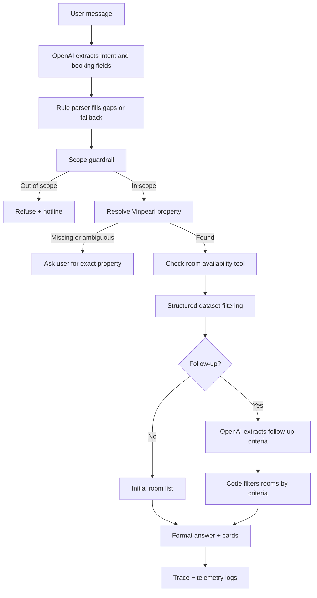

# Group Report: Lab 3 - Vinpearl Room Agent

- **Team Name**: Vinpearl Room Agent Team
- **Team Members**:
  - Lê Văn Khoa - 2A202600603
  - Nguyễn Phúc Hiếu - 2A202600747
  - Lê Quang Hưng - 2A202600891
- **Deployment Date**: 2026-06-01
- **Repository Branches**: `main`, `Khoa`

---

## 1. Executive Summary

The team built a domain-specific ReAct-style agent for Vinpearl room availability. The system answers only room-search questions, requires a Vinpearl property/address before checking inventory, supports natural-language follow-up questions, and refuses unrelated questions with a hotline handoff.

The core design is intentionally not a free-form chatbot. The LLM is used for intent and parameter extraction, while room availability, prices, bed options, meal plans, policies, and promotions are retrieved from structured data and validated by code. This reduces hallucination risk for high-precision fields such as room price and availability.

- **Automated Test Success Rate**: 17/17 tests passed.
- **Observed Runtime QA Logs**: 464 `VINPEARL_QA` events in `logs/2026-06-01.log`.
- **OpenAI Runtime Calls**: 57 successful real OpenAI extraction calls in the observed log, excluding fake unit-test calls.
- **Key Outcome**: Agent v2 correctly handles multi-turn refinement such as "phòng trên 80m2", "giường King + buffet sáng + phòng lớn", and "phòng khác không?", which a plain chatbot baseline can easily answer with repeated or hallucinated content.

---

## 2. System Architecture & Tooling

### 2.1 ReAct Loop Implementation

The Vinpearl agent uses a domain-specific ReAct loop implemented in `src/agent/vinpearl_agent.py`.



Each response exposes a trace in the format:

```text
Thought: ...
Action: ...
Observation: ...
Final Answer: ...
```

This makes the reasoning path inspectable in the UI and in logs.

### 2.2 Tool Definitions

| Tool / Module | Input Format | Output | Use Case |
| :--- | :--- | :--- | :--- |
| `VinpearlKnowledgeBase.find_locations` | `keyword: str` | matched Vinpearl properties | Find candidate hotels from user text or region. |
| `VinpearlKnowledgeBase.resolve_hotel` | `keyword: str` | found / missing / ambiguous | Decide whether the user provided a specific enough property. |
| `VinpearlKnowledgeBase.check_room_availability` | `hotel_id`, `checkin`, `checkout`, `guests` | available room options | Validate date range, room capacity, inventory, rates, promotions, policies. |
| `_extract_request_with_llm` | user message + context + known locations | JSON request fields | Extract `intent`, `location_query`, `checkin`, `checkout`, `guests`. |
| `_extract_follow_up_with_llm` | follow-up message + current room options | JSON criteria | Extract filters such as bed type, breakfast, area, budget, sort mode. |
| `_select_options_for_response` | available rooms + criteria | filtered rooms | Apply deterministic filters so LLM cannot invent room data. |

The main structured data source is:

```text
data/vinpearl_nationwide_agent_demo_dataset.json
```

### 2.3 LLM Providers Used

- **Primary**: OpenAI `gpt-4o`
- **Provider wrapper**: `src/core/openai_provider.py`
- **Fallback**: deterministic parser and rule-based filtering if OpenAI is unavailable.
- **Local provider support**: `src/core/local_provider.py` exists for local models, but the Vinpearl web app primarily uses OpenAI via `.env`.

Current OpenAI invocation pattern:

```python
response = self.client.chat.completions.create(
    model=self.model_name,
    messages=messages,
)
```

Recommended production hardening:

```python
temperature=0
max_tokens=300
response_format={"type": "json_object"}
```

---

## 3. Telemetry & Performance Dashboard

Telemetry is written as JSON lines to:

```text
logs/2026-06-01.log
```

Key event types:

| Event | Purpose |
| :--- | :--- |
| `VINPEARL_AGENT_START` | Captures user input and context summary. |
| `OPENAI_EXTRACT_REQUEST` | Successful OpenAI booking extraction. |
| `OPENAI_EXTRACT_REQUEST_FAILED` | Failed OpenAI booking extraction. |
| `OPENAI_EXTRACT_FOLLOW_UP` | Successful OpenAI follow-up extraction. |
| `OPENAI_EXTRACT_FOLLOW_UP_FAILED` | Failed OpenAI follow-up extraction. |
| `VINPEARL_QA` | Stores question, answer, status, room cards, and summary. |

Observed metrics from `logs/2026-06-01.log`, excluding fake unit-test LLM calls:

| Metric | Value |
| :--- | ---: |
| Successful OpenAI extraction calls | 57 |
| Booking extraction calls | 37 |
| Follow-up extraction calls | 20 |
| Average latency | 1,568.1 ms |
| P50 latency | 1,469 ms |
| Max latency | 3,518 ms |
| Average total tokens per LLM call | 1,821.9 |
| Average prompt tokens per LLM call | 1,772.9 |
| Average completion tokens per LLM call | 49.1 |
| Total observed LLM tokens | 103,851 |

Observed QA status distribution:

| Status | Count |
| :--- | ---: |
| `ok` | 361 |
| `no_more_rooms` | 31 |
| `out_of_scope` | 27 |
| `ambiguous_location` | 21 |
| `missing_location` | 18 |
| `no_rooms` | 3 |
| `invalid_dates` | 3 |

The failed OpenAI calls in the log were primarily from an invalid/overridden API key during development. The fix was to load `.env` with `override=True`, so the project `.env` key takes priority over stale system environment variables.

---

## 4. Root Cause Analysis - Failure Traces

### Case Study 1: Follow-up Repeated Old Room List

- **Input**: `tôi cần phòng trên 80m2`
- **Observed Failure**: The agent initially returned the same old list instead of filtering rooms by area.
- **Root Cause**: Follow-up classification treated area/detail terms as generic detail questions. `_extract_option_criteria` did not parse `trên 80m2` into a numeric filter.
- **Fix**:
  - Added `_extract_area_criteria`.
  - Moved criteria extraction before generic detail classification.
  - Added deterministic filters:

```python
room["area_sqm"] > criteria["min_area_sqm"]
room["area_sqm"] < criteria["max_area_sqm"]
```

- **Validation**:
  - Added `tests/test_vinpearl_area_followup.py`.
  - Verified `trên 80m2` returns only `VILLA_2BR` and `FAMILY`.

### Case Study 2: Follow-up With Multiple Constraints

- **Input**: `tôi cần phòng có giường King, và có buffet sáng, diện tích phòng lớn`
- **Observed Failure**: Rule-only matching could miss compound natural-language criteria or return rooms that did not match all constraints.
- **Root Cause**: Initial follow-up handling did not use LLM to extract compound criteria such as bed type + meal plan + area sorting.
- **Fix**:
  - Added `_extract_follow_up_with_llm`.
  - Added sanitized criteria schema: `bed_keywords`, `amenity_keywords`, `min_area_sqm`, `max_area_sqm`, `sort`, `recommendation`.
  - Kept final room selection deterministic in `_select_options_for_response`.
- **Validation**:
  - Added test `test_follow_up_filters_multiple_room_criteria`.
  - API test returned `SUITE` and `PREMIER`, both with king bed and breakfast.

### Case Study 3: OpenAI Authentication Failure

- **Observation**:

```text
OPENAI_EXTRACT_REQUEST_FAILED
AuthenticationError: 401 invalid_api_key
```

- **Root Cause**: The process-level `OPENAI_API_KEY` overrode the project `.env` key because `load_dotenv()` does not override existing environment variables by default.
- **Fix**:

```python
load_dotenv(PROJECT_ROOT / ".env", override=True)
```

- **Result**: Trace showed successful OpenAI calls with `provider=openai`, `model=gpt-4o`, and token usage.

---

## 5. Ablation Studies & Experiments

### Experiment 1: Chatbot Baseline vs Agent

| Case | Plain Chatbot Baseline | Vinpearl Agent v2 | Winner |
| :--- | :--- | :--- | :--- |
| Ask unrelated coding question | May answer coding question | Refuses as out-of-scope + hotline | Agent |
| Ask "Tìm phòng Vinpearl Phú Quốc..." | May guess a property | Asks user to choose exact property if ambiguous | Agent |
| Ask for rooms over 80m2 | May summarize old results or hallucinate | Filters `area_sqm > 80` from structured data | Agent |
| Ask for king bed + breakfast + large room | May produce natural but unreliable answer | Extracts criteria and filters room data | Agent |
| Ask "chi tiết phòng 2" | Lacks memory of actual cards | Uses context and displayed room IDs | Agent |

### Experiment 2: Agent v1 vs Agent v2

| Capability | Agent v1 | Agent v2 |
| :--- | :--- | :--- |
| Initial room search | Working | Working |
| Location ambiguity handling | Working | Working |
| Follow-up room details | Partial | Improved |
| Area filter | Missing/weak | Supports `trên/dưới N m2` |
| Compound criteria | Weak | LLM extraction + deterministic filtering |
| API key failure handling | Raw error/fallback | Error logged, LLM disabled for session, fallback parser |
| No-data handling | Generic message | Hotline handoff |
| UI message quality | Included technical "dataset demo" text | User-friendly copy |

### Experiment 3: Rule Parser vs LLM Criteria Extraction

| Criterion | Rule Parser | LLM Follow-up Extractor |
| :--- | :--- | :--- |
| `trên 80m2` | Reliable after regex fix | Also understood |
| `giường King` | Reliable keyword match | Normalizes to `king` |
| `buffet sáng` | Reliable keyword match | Normalizes to `buffet` |
| Compound request | Possible but brittle | More flexible |
| Final room decision | Deterministic | Not used directly |

Important design decision: the LLM extracts criteria, but code performs final filtering. This combines language flexibility with data accuracy.

---

## 6. Production Readiness Review

### Security

- API keys are loaded from `.env`; `.env` is ignored by git.
- OpenAI error messages are sanitized by `_safe_error_message` to avoid logging raw API keys.
- The agent refuses unrelated questions to reduce misuse.

### Guardrails

- Out-of-scope detection for topics such as coding, finance, news, weather, and politics.
- Property/address is required before availability checks.
- Ambiguous locations trigger clarification.
- No-data cases return a safe message and hotline.
- LLM failures fall back to deterministic parsing.

### Reliability

- Automated test suite covers location requirements, ambiguity, room availability, follow-ups, details, meal questions, budget recommendations, area filters, compound criteria, and hotline cases.
- Final validation command:

```powershell
python -m pytest -q
```

Result:

```text
17 passed
```

### Scaling Path

- Replace JSON dataset with a database or booking API.
- Add `response_format={"type":"json_object"}`, `temperature=0`, and `max_tokens` limits to OpenAI calls.
- Add cost estimation using official model pricing rather than mock pricing.
- Add a RAG layer for policies/FAQs while keeping availability/pricing as structured tool outputs.
- Add an evaluator script to run a fixed benchmark suite and export success rate, token cost, and latency.

---

## 7. Group Learning Points

1. A chatbot is good at fluent text, but unreliable for structured booking data unless constrained.
2. A ReAct-style agent is stronger because it can route from natural language to tools, inspect observations, and produce traceable outputs.
3. LLM output should be treated as a proposal, not as source of truth, for business-critical data.
4. Telemetry made debugging concrete: authentication failures, repeated answers, and bad follow-up classification were visible in logs.
5. The best version combined LLM understanding, rule-based fallback, deterministic filtering, and domain guardrails.
